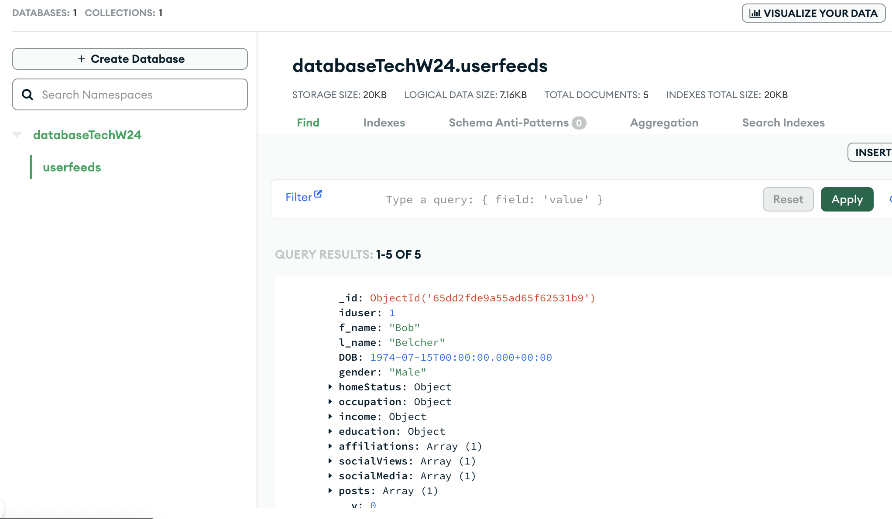
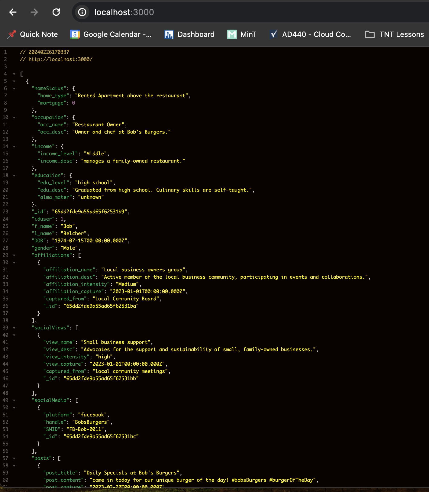

# Basic MongoDB and Express application

The following application uses express and mongoose to upload and fetch data to our MongoDB database

- In assets folder, I created a simple function to upload our data. UserFeed.js, in models folder, handles connection to mongoDB and handle schema for our data
  
- Using the data from data.js, we import the UserFeed model and are able to fetch all of the data from our MongoDB cloud database
  

## How to Run the Server

1. [Clone](https://docs.github.com/en/repositories/creating-and-managing-repositories/cloning-a-repository) or [Fork](https://docs.github.com/en/pull-requests/collaborating-with-pull-requests/working-with-forks/fork-a-repo) the repository from Github.
1. In project directory terminal, run `npm install` to install all dependencies. Notice there is now a package-lock.json created.
1. In terminal, run `npm run build` to create a server instance
1. In your web browser, navigate to: http://localhost:3000/ to view a local instance of the server.

## Additional Details

- In terminal, run `node -v`. If the command is not recognized, [Install LTS Version 20.11.0 of Node.js](https://nodejs.org/en/download)
- The server uses [Express](https://www.npmjs.com/package/express) to handle site routing.
- Any errors relating to node version incompatibility, ensure to switch to **node version 20.11.0** using [nvm](https://www.freecodecamp.org/news/node-version-manager-nvm-install-guide/) or [fnm](https://www.freecodecamp.org/news/fnm-fast-node-manager/)
- Use `npx nodemon index.js` to initiate [nodemon](https://www.npmjs.com/package/nodemon) for server development. Use **ctrl + c** to terminate nodemon execution.
- You will need to setup your own [MongoDB account](https://www.mongodb.com/)
